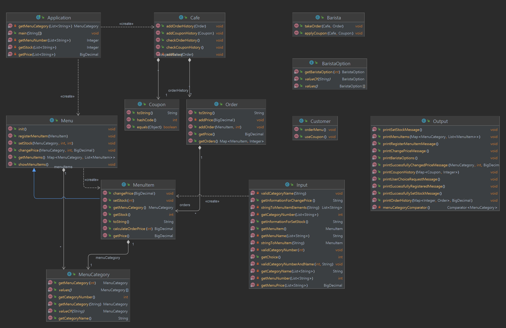

# ☕ 미션: [커피 주문 애플리케이션](README_original.md)

## 실행 로직
### 손님 (2주차 미션)
1. 프로그램 실행
2. 메뉴 출력
   1. 메뉴를 선택
3. 주문 내역 출력
4. 쿠폰 적립 여부 출력 (쿠폰은 음료 1개당 1개씩 적립, 디저트는 적용 X)
   1. 쿠폰 적립 여부를 선택 
      1. (적립 선택 시) 전화번호 입력 
5. 쿠폰 개수 출력
   1. (쿠폰이 10개인 경우) 쿠폰 사용 여부 출력
      1. (쿠폰 사용 선택 시) 쿠폰을 사용할 메뉴 출력
      2. 사용 완료 메시지 출력
6. 최종 주문 내역 출력 (쿠폰 사용 반영)
7. 주문 완료 메시지 출력

### 바리스타 (3주차 미션)

## 🔧 구현 기능 목록

### 메뉴 
- [x] 기본 메뉴 생성
- [x] 메뉴 출력
- [x] 고객이 주문 (예: 1-1, 2)
- [x] 주문 객체 생성
- [x] 주문 객체를 거래내역 객체로 변환 
- [x] 거래내역 객체를 DB에 저장 
- [x] 주문 내역 출력

### 쿠폰 
- [x] 쿠폰 적립 여부 출력
- [x] 쿠폰 적립 여부 입력
  - [x] (적립 선택 시) 전화 번호 입력 가이드 출력
  - [x] 고객이 전화번호 입력
    - [ ] (예외) 전화번호 형식 "000-0000-0000"
  - [x] 쿠폰 DB에 입력한 전화번호와 일치하는 데이터 있는지 확인
    - [x] 일치하는 데이터가 있으면 쿠폰 개수 출력
    - [x] 일치하는 데이터가 없으면, 
      - [x] {전화번호:쿠폰 개수} 데이터 생성
- [x] 쿠폰 개수 출력 

- [x] 쿠폰이 10개 이상인지 확인 
    - [x] 쿠폰이 10개 이상이면, 쿠폰 사용 여부 출력
      - 사용 선택 시
          - [ ] 적용할 메뉴 선택 (음료 1개에 대해서만 사용 가능)
          - [ ] 손님의 쿠폰 10개 차감 
          - [ ] (쿠폰 사용을 적용한) 주문 내역 출력
- [x] 주문한 음료 개수 만큼 쿠폰 추가
  - [ ] 쿠폰 적용(쿠폰 10개 사용)을 한 경우 쿠폰 적립 X
- [ ] 최종 주문 내역 출력

## 클래스 다이어그램

## 리팩터링
- 원래 각 주문에서 생기는 쿠폰을 해당 주문에서 바로 사용할 수는 없다. 이것을 반영하여 수정해본다. 
- outputview에서 MenuDatabase의 접근 권한을 갖게 되는데 이것을 어떻게 수정할까

## 피드백

## 객체 지향 생활 체조
- [ ] 규칙 1: 한 메서드에 오직 한 단계의 들여쓰기만 한다.
- [ ] 규칙 2: else 예약어를 쓰지 않는다.
- [ ] 규칙 3: 모든 원시값과 문자열을 포장한다.
- [ ] 규칙 4: 한 줄에 점을 하나만 찍는다.
- [ ] 규칙 5: 줄여쓰지 않는다(축약 금지).
- [ ] 규칙 6: 모든 엔티티를 작게 유지한다.
- [ ] 규칙 7: 2개 이상의 인스턴스 변수를 가진 클래스를 쓰지 않는다.
- [ ] 규칙 8: 일급 콜렉션을 쓴다.
- [ ] 규칙 9: 게터/세터/프로퍼티를 쓰지 않는다.