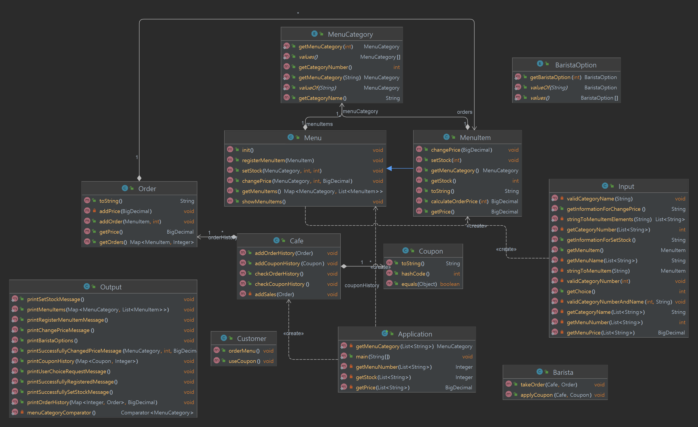

# 커피 주문 애플리케이션

## 깃허브
**[java-coffee-order](https://github.com/programmers-lecture/java-coffee-order)**

## 요구사항

- 커피 가게의 도메인을 파악한다.
- 프로그램을 모두 콘솔 UI로 진행한다.
- 사용자는 손님과 바리스타 두명이 있다. (이번 2주차 요구사항은 바리스타 우선 구현후 3주차에 손님을 구현)
- 가격이 입력되어 있지 않는 메뉴는 0원이다.
- 손님이 메뉴를 고르지 않을 경우 validate를 진행한다.
- 이미 쿠폰이 있는 경우는 +를 진행한다.
- validate를 고려해서 프로그램을 작성한다.

## 1단계 (2주차)
- 관리자인 바리스타 구현한다.

## 2단계 (3주차)
- 손님 역할을 구현한다.

## 프로그램 실행 결과

```

"사용자를 선택하세요"
"1. 손님 / 2. 바리스타"

#----------------------------------#


// 바리스타 선택시 출력 문구
"사용할 메뉴를 선택하세요"
"1. 커피 등록"
"2. 수량 등록"
"3. 가격 변경"
"4. 주문 내역 확인"
"5. 쿠폰 내역 확인"

-----------------


// 1번 선택 시

"번호와 이름, 가격을 입력해주세요."
"ex) 1. 커피, 1-1. 에스프레소, 2000"

1. 커피, 1-1. 에스프레소, 2000

"입력이 완료되었습니다."

-----------------


// 2번 선택 시
"번호와 수량을 선택해주세요. (ex) 1-1, 10)"

...

"1. 커피"
  "1-1 에스프레소" // 1개
  "1-2 아메리카노" // 2개
  "1-3 콜드블루" // 3개
  "1-4 카페라떼"

...

"2. 티"
  "2-1 그린티" ..

...

"3. 디저트"
  "3-1. 케잌"

...

>> 1-1, 1
...
>> 1-2, 2
...
>> 1-3, 3

"입력이 완료되었습니다."


-----------------


// 3번 선택시
"번호와 가격을 선택해주세요. (ex) 1-1, 2500)"

...

"1. 커피"
  "1-1 에스프레소" // 2000원
  "1-2 아메리카노" // 3000원
  "1-3 콜드블루" // 4000원
  "1-4 카페라떼"

...

"2. 티"
  "2-1 그린티" ..

...

"3. 디저트"
  "3-1. 케잌"

...


>> 1-1, 2500

" 1-1 의 가격을 2500 원으로 변경하셨습니다. "

-----------------

// 4번 선택시 (주문내역 확인)

"1. 1-1 에스프레소 1개 / 1-2 아메리카노 1개 -> 총 5000원"
"2. 1-1 에스프레소 1개(쿠폰 사용) / 1-2 아메리카노 1개 -> 총 3000원"
-----------------
"현재까지 매출 : 8000원"


-----------------


// 5번 선택시 (누적된 쿠폰 정보 확인)
"1. 010-1234-1234 - 2개"


#----------------------------------#

// 손님 선택시 출력 문구
"메뉴를 골라주세요 (번호, 갯수)"

...

"1. 커피"
  "1-1 에스프레소"
  "1-2 아메리카노"
  "1-3 콜드블루"
  "1-4 카페라떼"

...

"2. 티"
  "2-1 그린티" ..

...

"3. 디저트"
  "3-1. 케잌"

...

// 사용자 입력 -> 에소프레소 1잔, 아메리카노 2잔
>> 1-1, 1
...
>> 1-2, 2

-----------------


// 주문완료 시 출력문구
"주문 내역은 아래와 같습니다."
"에스프레소 1개 2000원"
"아메리카노 2개 6000원"

"총 가격 : 8000원"

"쿠폰을 적립하시겠습니까?"
"1. 네 / 2. 아니요"

-----------------

// 1번 선택시
"전화번호를 입력해주세요. (형식 : 000-0000-0000)"
010-1234-1234

"현재 쿠폰 갯수는 3개 입니다."

-----------------

// 쿠폰이 10개인 경우
"쿠폰을 사용하시겠습니까?"
"1. 네 2. 아니요"

-----------------

// 1번(쿠폰 사용) 선택시
사용할 메뉴를 골라주세요.
"1-1. 에스프레소"
"1-2. 아메리카노"

1-1

// 쿠폰 사용시 출력 문구
"사용이 완료되었습니다."

-----------------
// 최조 결과 문구
"주문 내역은 아래와 같습니다."

"에스프레소 1개 쿠폰사용"
"아메리카노 2개 6000원"

"총 가격 : 6000원"

"주문 완료가 되었습니다."

-----------------

```

## 미션 가이드 (학생)

1. ReadMe에 각 객체에 대한 간단한 다이어그램(설명)을 작성한다.
2. ReadMe에 각 요구사항에 대한 체크 리스트를 작성한다.
3. 커밋은 최소한의 단위로 진행한다.
4. 객체지향 생활 체조를 지켜서 개발한다.

[객체지향생활체조](https://developerfarm.wordpress.com/2012/02/03/object_calisthenics_summary/)

## 다이어그램(설명)


## 체크 리스트
- 기능 목록
  - [x] 메뉴 등록 : registerMenuItem()
  - [x] 수량 등록 : setStock()
  - [x] 가격 변경 : changePrice()
  - [x] 주문 내역 확인 : checkOrderHistory()
  - [x] 쿠폰 내역 확인 : checkCouponHistory()
  - [ ] 메뉴 주문 : orderMenu()
  - [ ] 쿠폰 사용 : useCoupon()
  - [ ] 주문 받기 : takeOrder()
  - [ ] 쿠폰 적용 : applyCoupon()

  
- 클래스
  - [ ] 손님 : orderMenu(), useCoupon()
  - [x] 카페 : checkOrderHistory(), checkCouponHistory()
  - [x] 메뉴 : registerMenuItem(), setStock(), changePrice()
  - [ ] 바리스타 : takeOrder(), applyCoupon()